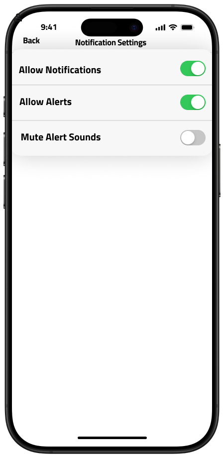
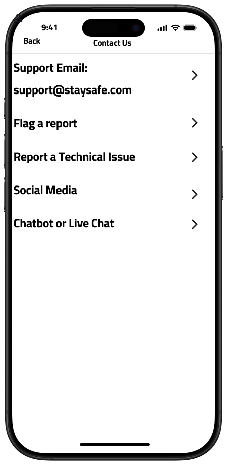

# UX-StaySafe 

## Wireframes

User presses search. The user is the car icon.

## Search Map Location

User types into the search bar for the location they want to view any crimes

The exclamation mark indicates that there is a crime reported nearby.

## Starred Reports

Click the see more from any of the starred reports to get a more in-depth report

Using Robbery at Chase Bank as an example, the user will see a similiar report as to this with pictures of scene and of suspects. 

User can always delete the report by swiping left on the report for the delete option appearing. 

There will be a confirmation for the user to delete the report just in case this mistakenly delete a report. 

From the user POV, now the report they deleted (Robbery at Chase Bank) is now gone from their starred reports.

## Find My Friends

Going back to the default page of map to go to another feature page which is "Friends".

Users can look up their friends to see if they are offline and online by tapping one's name and their location (permission given to the app). Users can also add friends with the plus button on the top right hand side of screen. 

The person icon is to represent the friend on the map.

In case there is a crime reported/onogoing near your friend on the live map, you have the option to send them an alert. This is just in case they don't have notifications turned on for crime alerts.

## Settings

Going back to the map home page, we can now click settings for more features. 

The user now clicks on "Location" from the options. 

On this page, the user has the option to slide the bar to customize the radius of where they can receive or view notifcations for any crimes happening. In addition, the user can adjust the time limit (hours or days) for how long the crime event is displayed on the map. After that, the user can click back to go back to the main settings page from the start.

Now the user can click on "Notifications".

The "Notification Settings" allows the user to toggle on or off any alerts and sounds for crimes on the app. Now the user clicks back to go back to the main settings page.

Now the user clicks on "Categories".

Now the user has the option to check on or off which crime categories they want to be alerted about. Now the user clicks back again to the last settings option.

The user will click on "Support".

The user will be directed to another page for support where three options are displayed. User clicks on "FAQ's".

This page will be displayed for the user if they have a quick and common asked questions regarding the app. Now the user can click back again and select another feature which will be "Feature Requests".

This page allows users to submit ideas to the developer teams if they have any features they would want to be added to the app. Now the user clicks back again for the last option for support which will be "Contact Us".

For "Contact Us", users will have a variety of ways to contact the dev team on any issues. For example, they could email with the provided email. Second, flag a report is an option for users if they believe a crime reported on the map is false. They will submit a ticket and the crime will be looked over and verified. Thirdly, if there's a technical issue within the app, users can submit a ticket and the dev team will get right on it. Fourth, "Social Media" displays StaySafe's social media if they want to be updated on any features we plan on bringing out.
Lastly, there will be a Chatbot or Live Chat if there are any urgent questions or questions wanting to be answered quickly if not in the FAQ's page.

